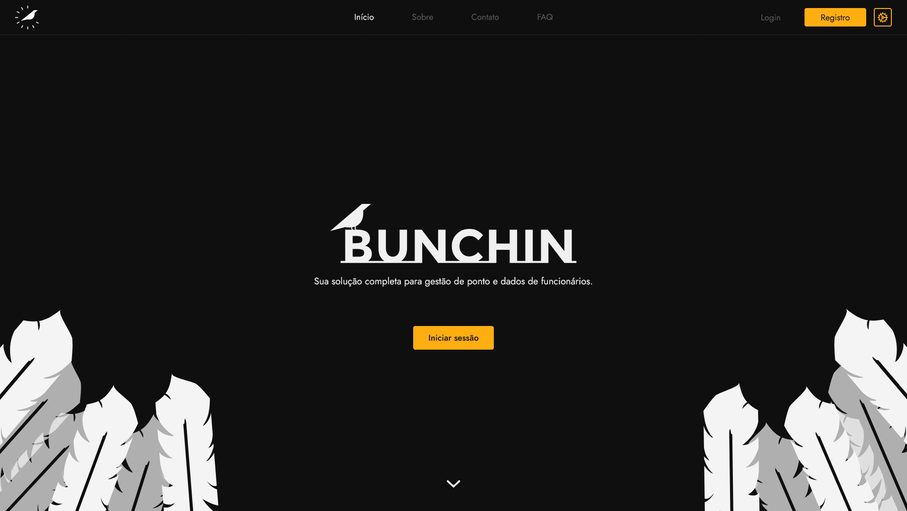

# Bunchin

> Online time tracking platform project.

### Adjustments and improvements

The project is still under development and the next updates will focus on the following tasks:

- [ ] Add profile page
- [ ] Add projects page
- [ ] Add tasks page
- [ ] Encrypt passwords in the database